<h1>Activité Pratique N°1- Injection des dépendances</h1>

<h3>- Interface IDao avec une méthode getData</h3>
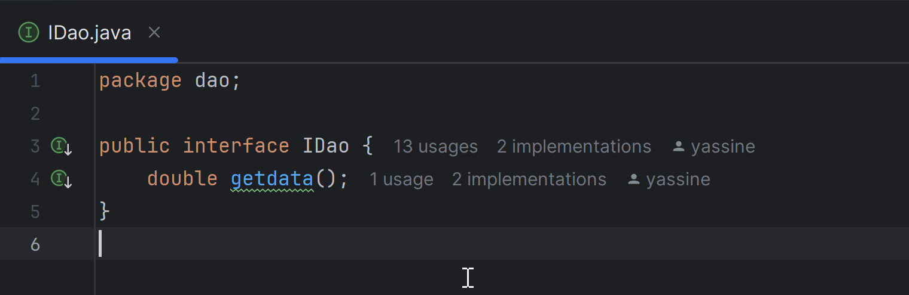

<h3>- Implémentation de cette interface </h3>
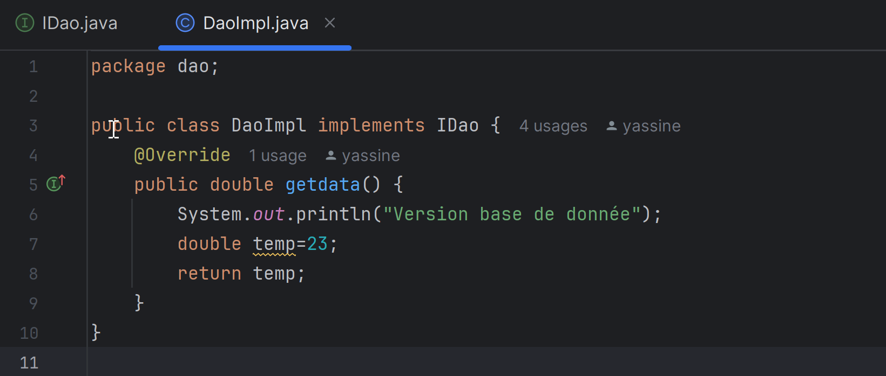

<h3>- Interface IMetier avec une méthode calcul </h3>
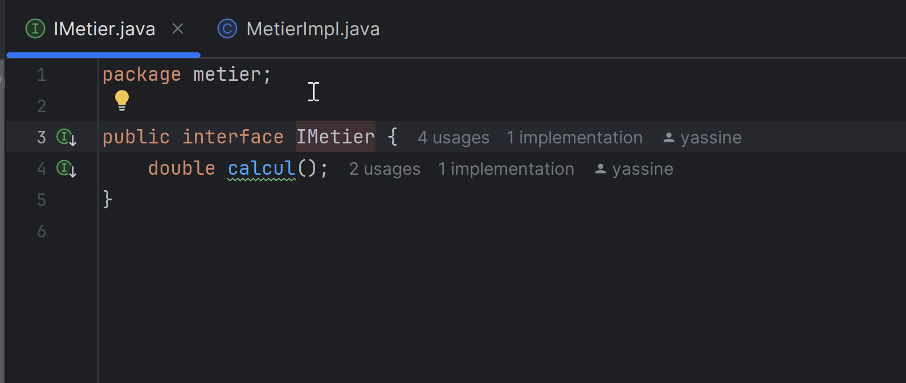

<h3>- Implémentation de cette interface en utilisant le couplage faible </h3>
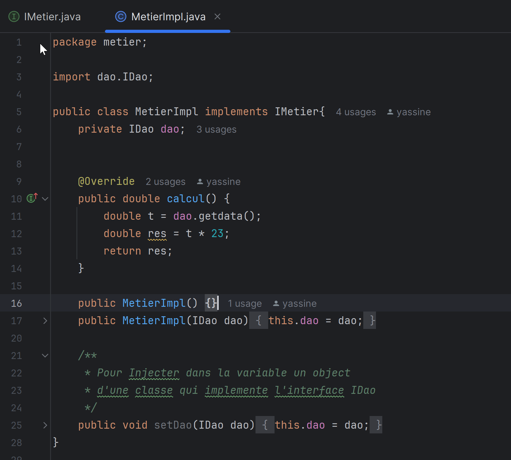

<h3>- Injection des dépendances Par instanciation statique </h3>
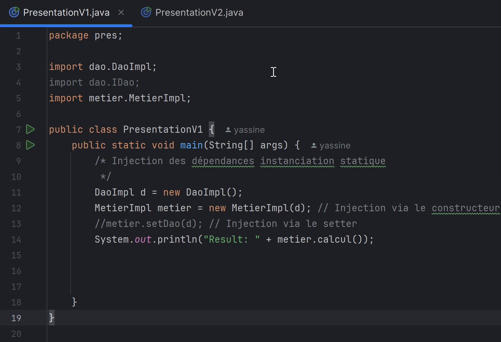

<h3>- Injection des dépendances Par instanciation dynamique</h3>
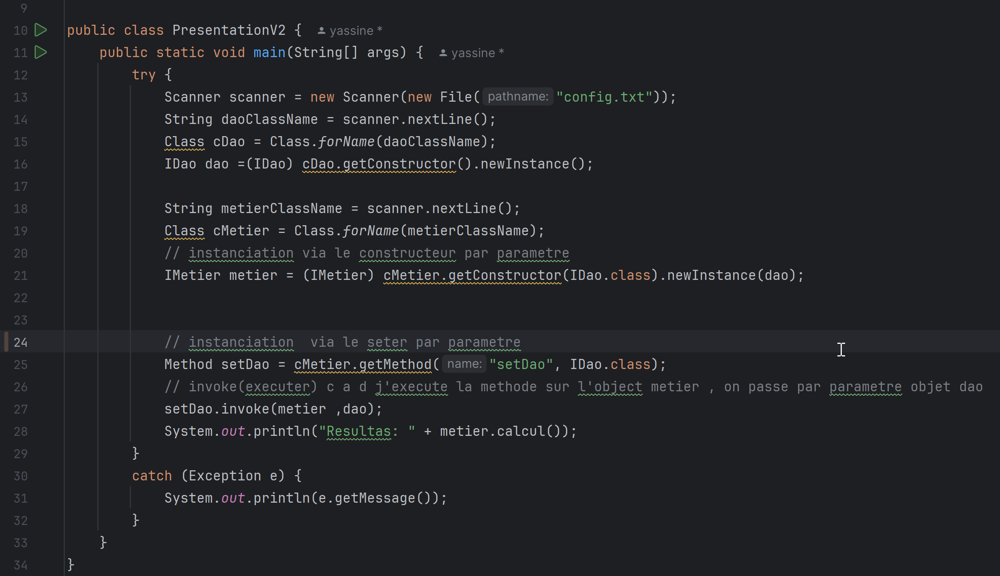

<h2>- Utlisation du Framework Spring </h2>

Ajouter les dependecy au fichier pom.xml 

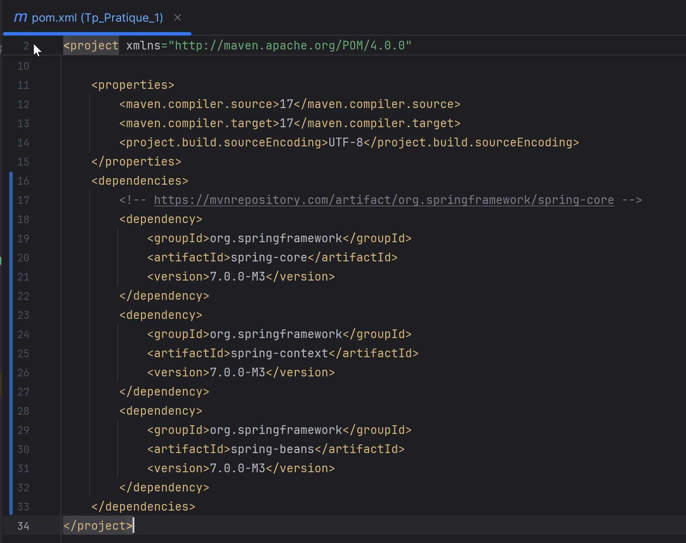
<h3>- Version XML :</h3>

Ajouter au dossier ressource le fichier "config.xml"

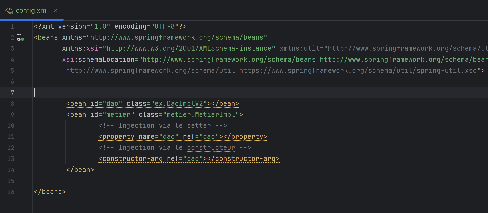

<h3>- Version Annotation :</h3>

 Ajouter l'annotation @component (Respository) , pour demander a spring de cree au demarrage 
    un object de cette class nommer 'dao'.

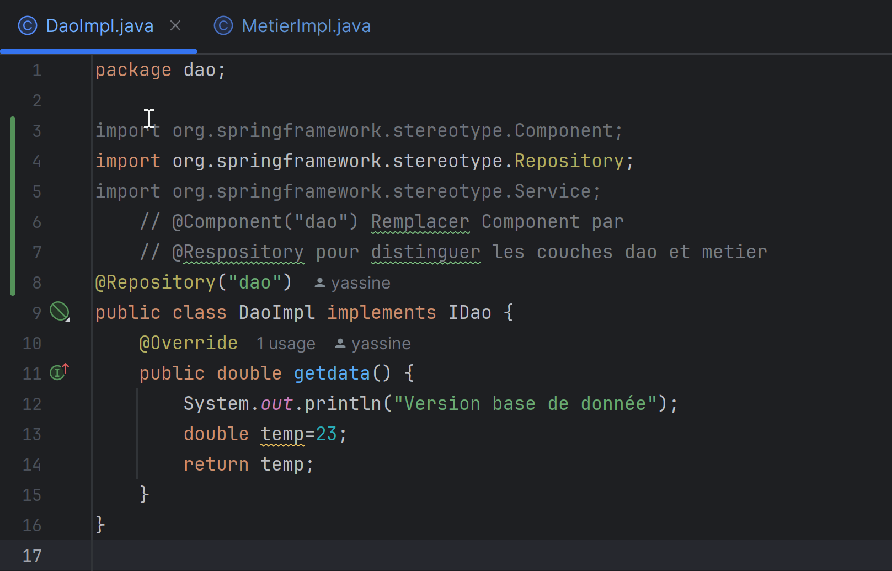

 Ajouter l'annotation @component (Service) , pour demander a spring de cree au demarrage 
    un object de cette class nommer 'metier'.

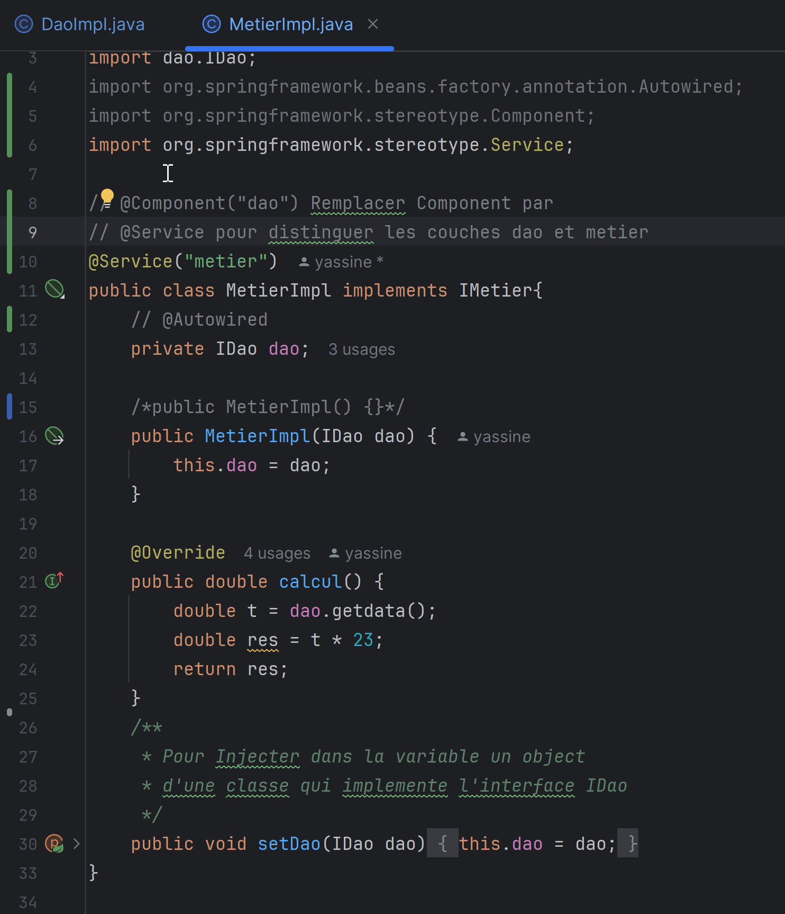

<h4>Injection des dependances:</h4>
<h5>Via l'annotation Autowired:</h5>

L'utilisation de Autowired est pas trop recommendé car au démarrage, Spring instancie l'objet de la classe utilisant @Autowired en 
appelant son constructeur sans paramètre. Ensuite, il accède directement à la variable 
grâce à l'introspection et à la programmation dynamique, puis lui affecte un objet. 
Dans ce processus, même si la variable est privée, Spring peut y accéder et la modifier 
directement,ce qui constitue une violation du principe d'encapsulation.

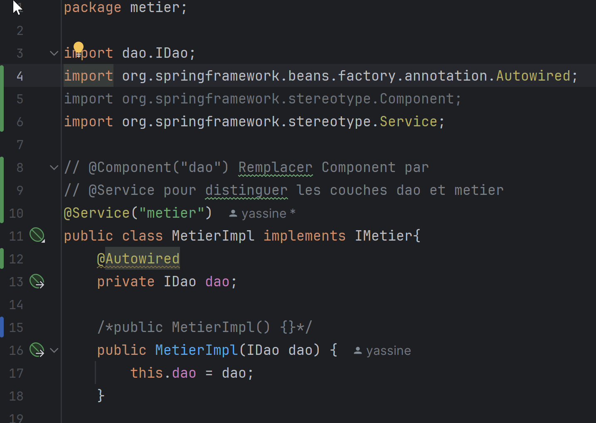

<h5>Via l'annotation Via le constructeur:</h5>

 Lorsqu'on utilise l'injection de dépendances par constructeur, 
il est important d'éviter d'avoir à la fois un constructeur sans paramètre et un autre avec des paramètres. En effet, Spring ne saura pas quel constructeur utiliser. 
Il est donc recommandé de ne conserver que le constructeur avec des paramètres.

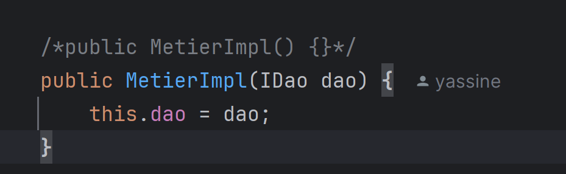

